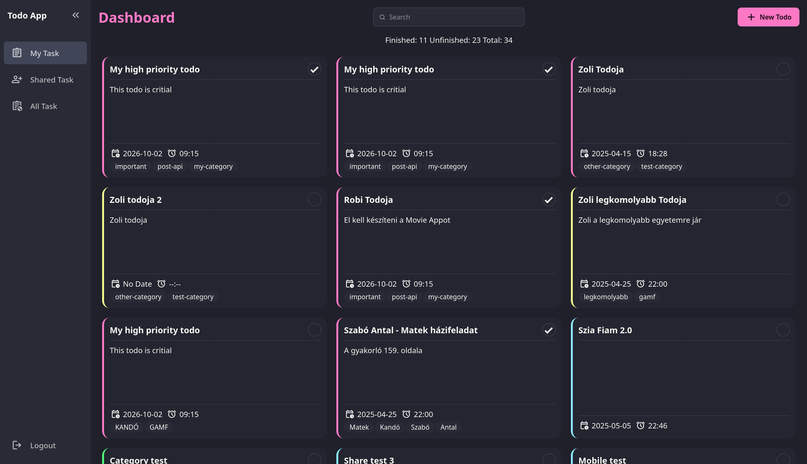
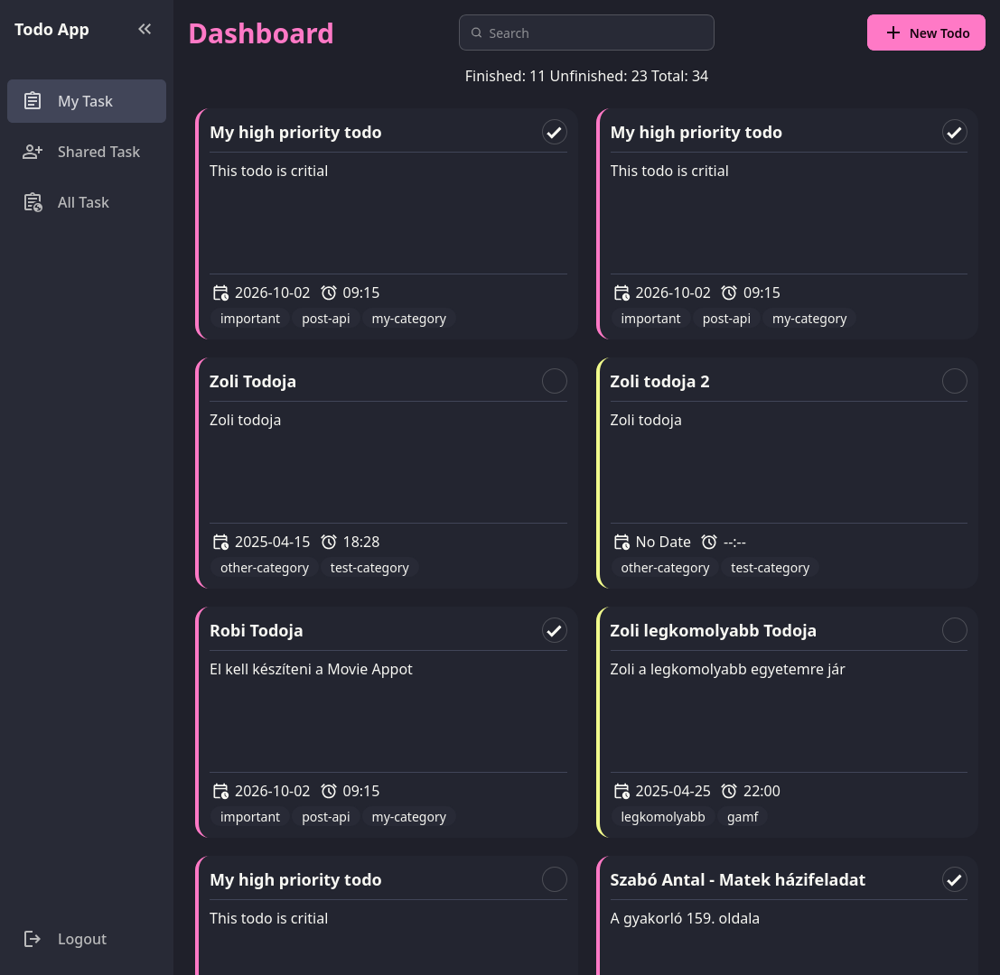
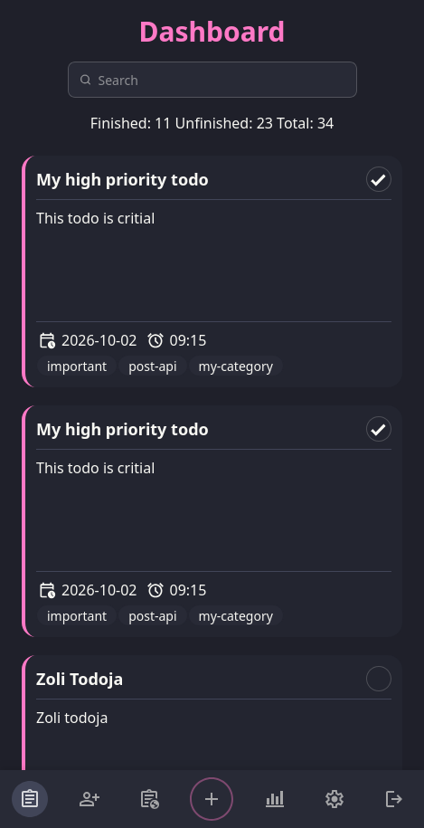

# Requirements
- Python > 3.13 - https://www.python.org/
- UV - https://docs.astral.sh/uv/getting-started/installation/
- Docker, Docker compose
- Node - https://nodejs.org/en

# Running the app
1. Create a `.env` file:
```bash
PROFILE=local
```
2. Create the `local-config` directory
```bash
mkdir local-config
```
3. DM me for config, paste the config in the `local-config` directory
4. Run the app:
```bash
uv run uvicorn src.microfastapitodowebapp.main:app --reload --no-access-log --port 8081
```
5. Run node in separate terminal:
```bash
cd src/frontend
npm run watch
```
6. Access the app at:
``http://localhost:8081``

---

# Todo Web App

### Live App

The application is deployed and available at: https://todo.robottx.hu/

A full‑stack **Todo management platform** built with:

* **FastAPI** (Python)
* **Jinja2** templating
* **TailwindCSS + DaisyUI** for styling
* **HTMX** for dynamic page updates
* **Alpine.js** for lightweight interactivity

The application allows users to **register and authenticate through Keycloak**, create todos, manage them and **share them with others** using configurable access levels.

---

# Features

### Core Todo Functionality

* Create, edit, delete todos
* Set **priority**, **deadline**, and **categories**
* Mark todos as complete

### Sharing & Access Control

* Share todos with other users
* Choose access level: **read**, **write**, **manage**

### Authentication via Keycloak

* Secure login/registration
* Protect routes and user data

### Frontend Interaction

* **HTMX** enables partial page updates without full reloads
* **Alpine.js** handles lightweight reactive UI behavior
* **TailwindCSS + DaisyUI** delivers a clean component-based UI

---

# Screenshots

Below are examples of how the Todo Web App looks across different devices, showcasing its responsive design powered by TailwindCSS, DaisyUI, HTMX, and Alpine.js.

### Desktop View


### Tablet View


### Mobile View


---

# Project Structure

```
MicroFastApiTodoWebApp/
├─ .github/
├─ src/
│  ├─ frontend/
│  │  └─ ... (Node/Tailwind/DaisyUI build setup)
│  ├─ microfastapitodowebapp/
│  │  ├─ config/
│  │  ├─ domain/
│  │  ├─ model/
│  │  ├─ router/
│  │  ├─ service/
│  │  ├─ util/
│  │  ├─ __init__.py
│  │  └─ main.py
│  └─ resources/
│     ├─ static/
│     │  ├─ css/
│     │  ├─ images/
│     │  └─ js/
│     └─ templates/
│        ├─ components/
│        ├─ dashboard/
│        ├─ partials/
│        ├─ base.html
│        └─ landing.html
```

---

# Development Notes

### Tailwind + DaisyUI

The frontend uses a watcher that automatically rebuilds styling on file changes.

### HTMX

Used to enable partial updates without hot‑reload, allowing dynamic refresh of specific UI elements, without reloading the full page.

### Alpine.js

Primarily used for lightweight UI behavior such as navbar active URL handling and dynamic :class bindings, enabling reactive styling without a heavy frontend framework.

